# Uptask - Frontend

Este repositorio contiene el frontend de Uptask, una aplicación cliente escrita con Vite + React + TypeScript diseñada para gestionar proyectos, tareas, notas y equipos.

Este README está enfocado únicamente en el proyecto frontend y en cómo instalarlo, ejecutarlo y desplegarlo.

## Resumen

- Stack: React, TypeScript, Vite.
- Cliente que consume una API REST (configurable mediante la variable de entorno `VITE_API_URL`).

## Requisitos

- Node.js 18+ y un gestor de paquetes (npm, pnpm o yarn).
- Conectividad con la API que expone los endpoints que usa la app (configurable con `VITE_API_URL`).

## Variables de entorno

Crear un archivo `.env` en la raíz de `uptask_frontend` con la siguiente variable mínima:

VITE_API_URL=http://localhost:4000/api

Notas:
- Vite expone al cliente sólo variables que empiecen por `VITE_`.
- Ajusta `VITE_API_URL` al dominio/puerto donde esté corriendo la API.

## Instalación

En la carpeta `uptask_frontend` instala las dependencias:

```powershell
npm install
# o
pnpm install
# o
yarn install
```

## Desarrollo

Levantar el servidor de desarrollo (Vite):

```powershell
npm run dev
# o
pnpm dev
# o
yarn dev
```

Por defecto Vite suele servir en http://localhost:5173 — revisa la salida de la consola.

## Build para producción

```powershell
npm run build
# o
pnpm build
# o
yarn build
```

La carpeta de salida por defecto es `dist`.

## Configuración de la API

La app realiza llamadas a la API usando los wrappers en `src/api/` y la configuración de axios en `src/lib/axios.ts`.

Si necesitas cambiar la URL base directamente en código (no recomendado), revisa `src/lib/axios.ts` y los archivos en `src/api/`.

## Estructura principal del frontend

- `src/api/` — funciones que envuelven las llamadas HTTP (AuthApi, ProjectAPI, TaskAPI, etc.).
- `src/components/` — componentes reutilizables y modales.
- `src/layouts/` — layouts de la aplicación (AppLayout, AuthLayout, ProfileLayout).
- `src/views/` — páginas/ rutas principales (Dashboard, Auth, Projects, Profile, etc.).
- `src/lib/axios.ts` — cliente axios centralizado.

## Depuración rápida

- Comprueba la consola del navegador y la pestaña Network para ver las peticiones.
- Verifica que `VITE_API_URL` sea accesible desde el navegador.
- Revisa `src/lib/axios.ts` para headers y manejo de tokens.

Ejemplo rápido en PowerShell para comprobar si la URL de la API responde (solo una comprobación básica):

```powershell
Invoke-WebRequest -Uri $env:VITE_API_URL -UseBasicParsing
```

Si no tienes `$env:VITE_API_URL` definido en PowerShell, ejecuta con la URL completa:

```powershell
Invoke-WebRequest -Uri "http://localhost:4000/api" -UseBasicParsing
```

## Tests

Actualmente no hay pruebas configuradas en el proyecto. Recomendación: añadir Vitest + React Testing Library para tests unitarios y de componentes.

## Despliegue

La app genera archivos estáticos en `dist` tras `npm run build`. Puedes desplegar en Vercel, Netlify, o cualquier hosting estático.

Sugerencia para Vercel:

- Comando de build: `npm run build`.
- Carpeta de salida: `dist`.
- Añade la variable de entorno `VITE_API_URL` en el dashboard de Vercel para apuntar a tu API.

## Buenas prácticas

- No incluyas secretos en el frontend; guarda tokens o credenciales en el backend.
- Mantén `VITE_API_URL` apuntando a la API correcta según entornos (dev/staging/prod).
- Usa la configuración centralizada en `src/lib/axios.ts` para manejar interceptores y refresh de tokens.

## Contribuir

1. Fork del repositorio.
2. Crea una rama `feature/descripcion-corta`.
3. Haz cambios pequeños y claros, añade tests si es posible.
4. Abre un Pull Request describiendo los cambios.


## Imagenes


## Auth
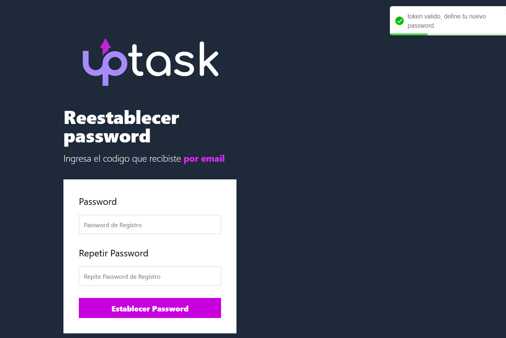
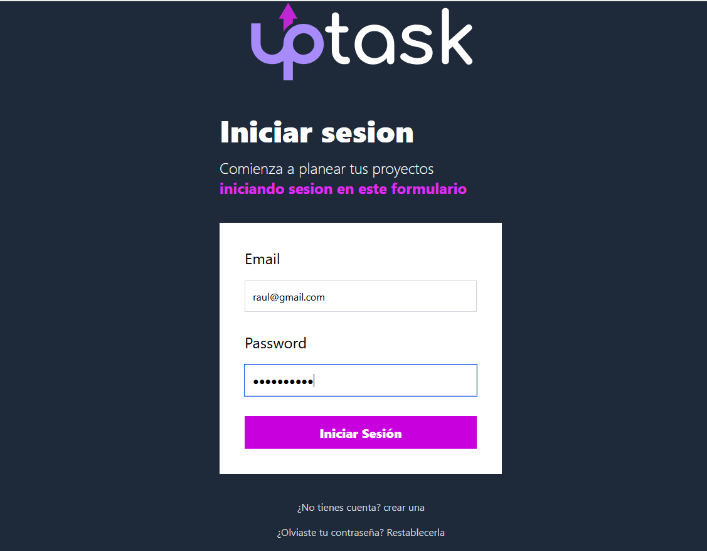

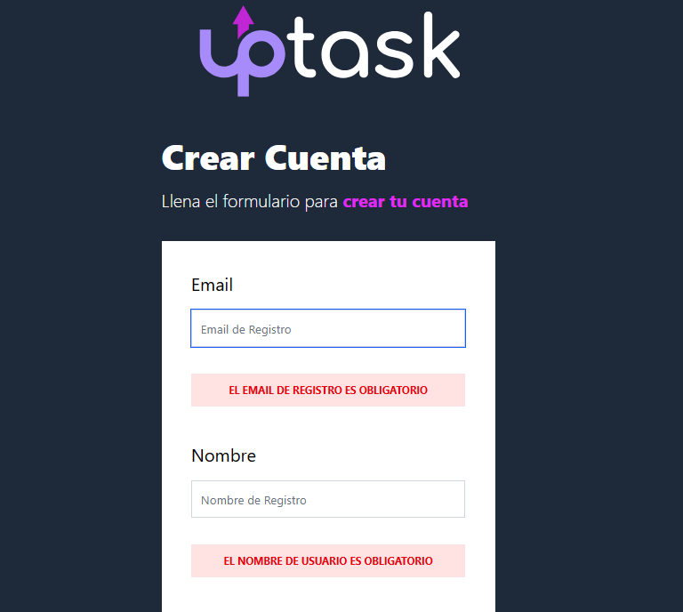
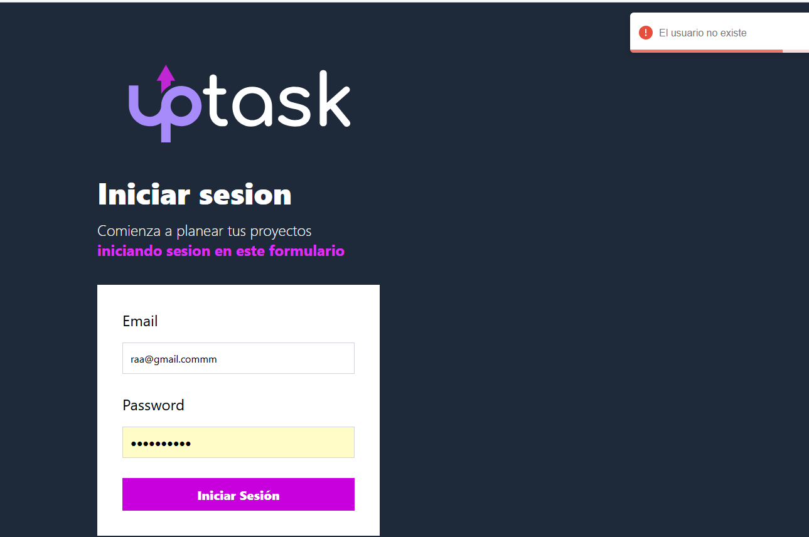

## Dashboard
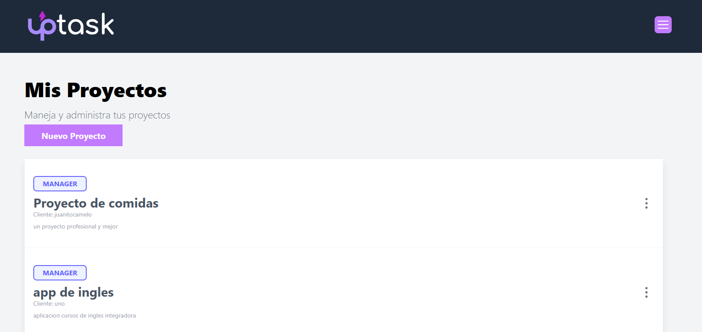
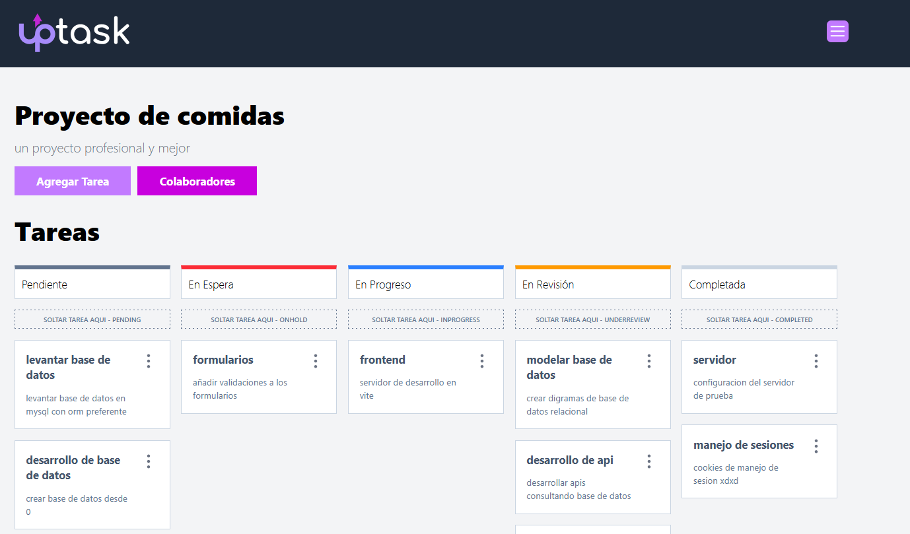
 
cards arrastrables
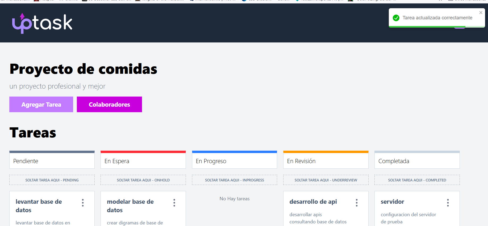


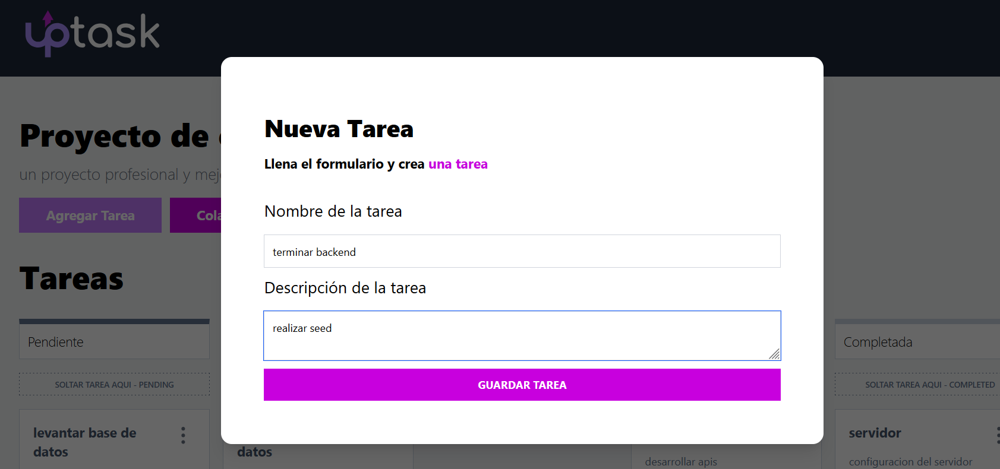
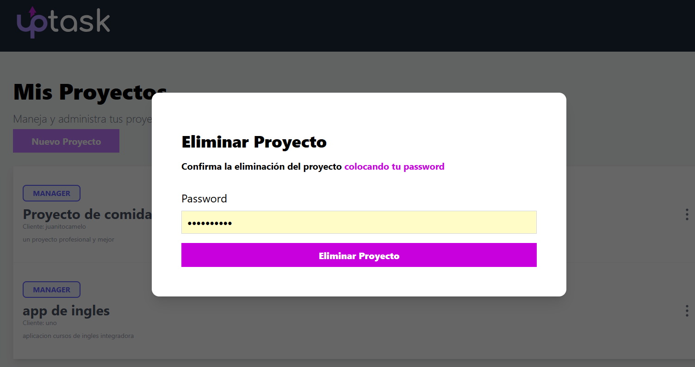

## Equipo
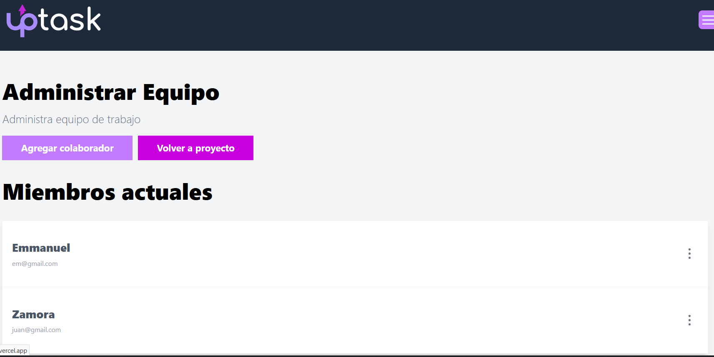
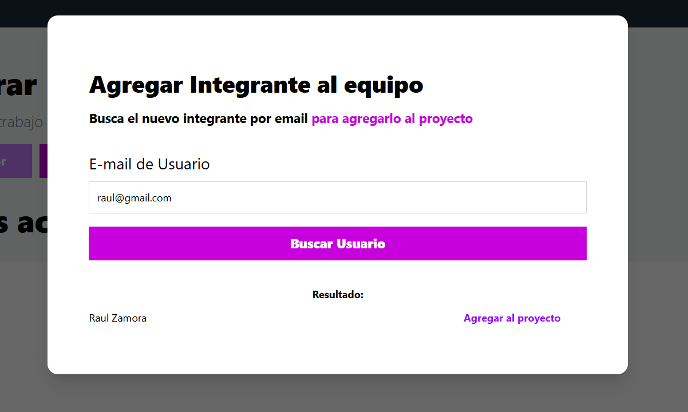


## Tareas
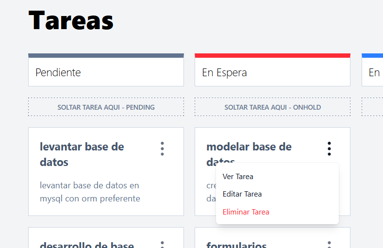
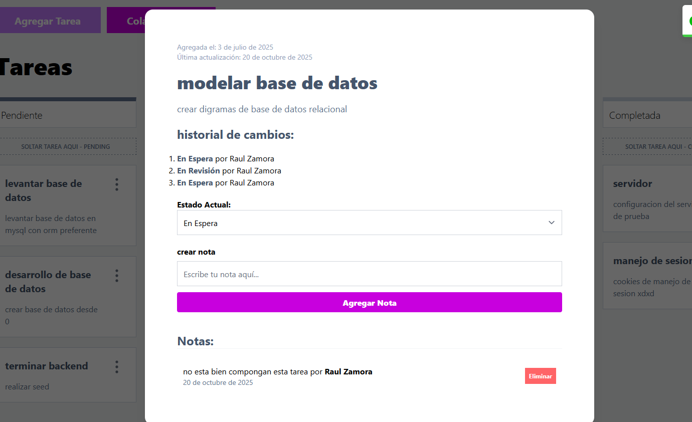


## Perfil
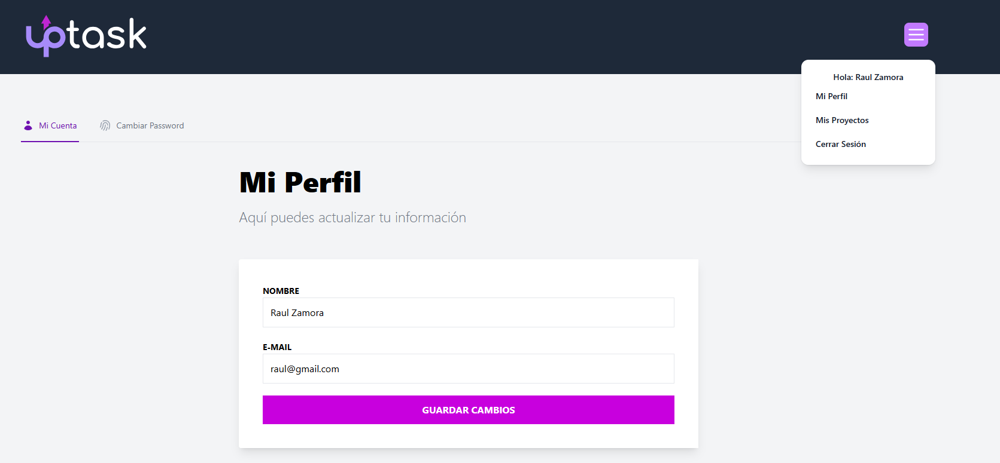
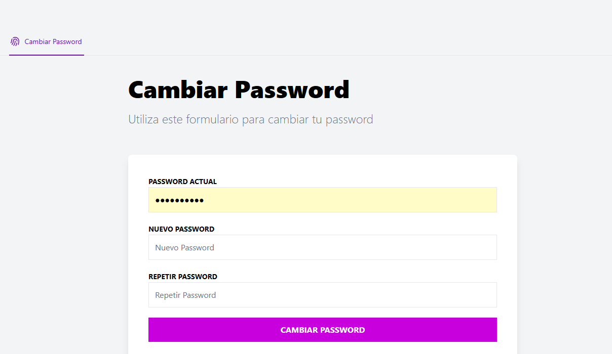